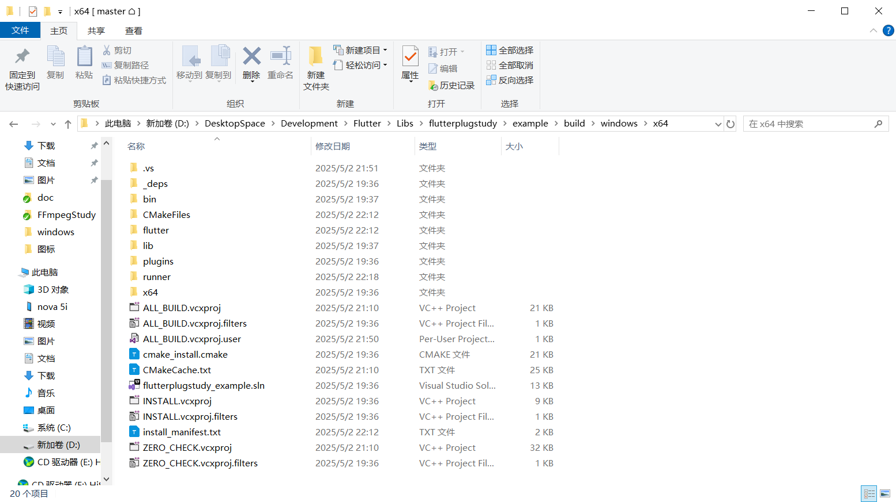
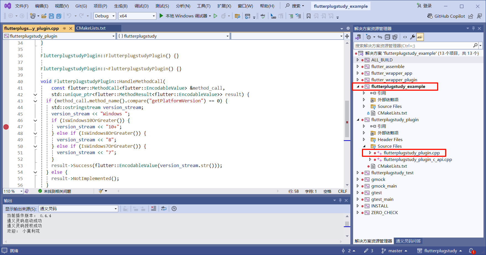
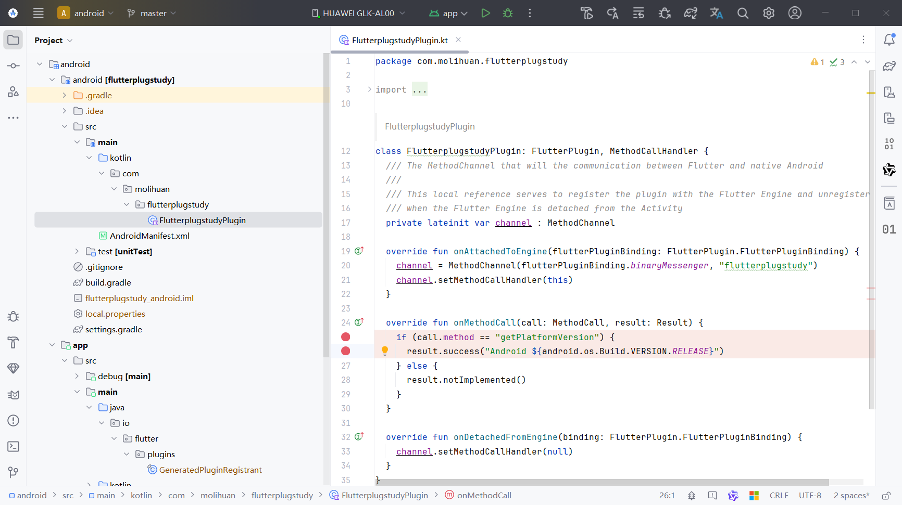
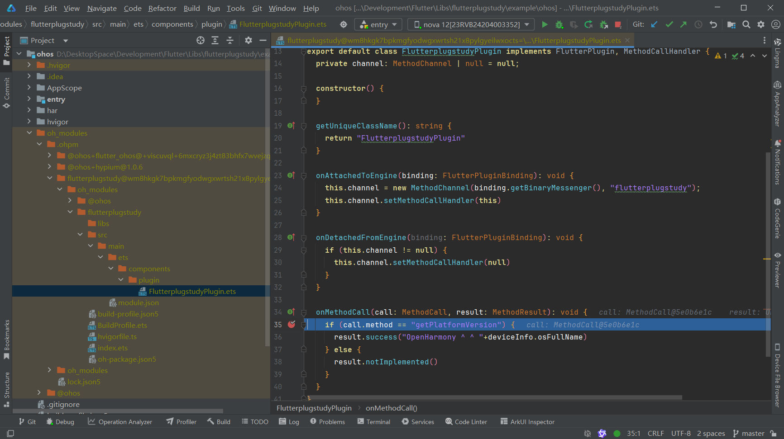

# Flutter 插件

1、创建插件

```shell
flutter create --org com.molihuan -t plugin --platforms=android,ios,web,windows,macos,linux,ohos flutterplugstudy
```

2、创建后一般会自动在插件项目中生成一个example示例，直接运行example示例各个平台看看有没有问题，有问题就解决，直到没问题。

3、调试

- windows:

  选择windows平台直接运行example示例，运行成功后会在example/build/windows/x64下生成一个Visual Studio工程，直接使用Visual Studio打开,等待CMake构建完成，选择创建的example示例为启动项目，在插件代码中打断点即可，flutter这边的在flutter中打断点。

  

  

- android:

  将example示例中的android用Android Studio打开,等待构建成功依赖加载完成即可在插件中依赖库中打断点。

  

- 鸿蒙

  将example示例中的ohos使用DevEco Studio打开，在项目根目录的oh_modules/.ohpm/flutterplugstudy/oh_modules/flutterplugstudy下打断点进行调试

  
